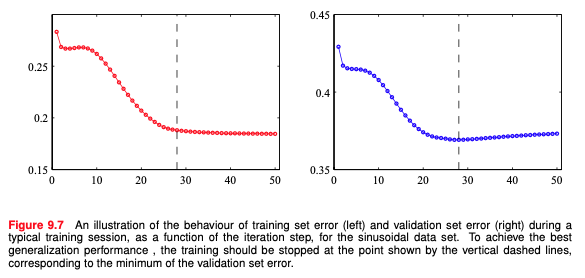
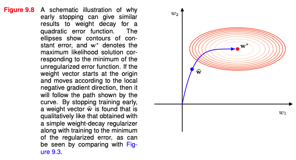
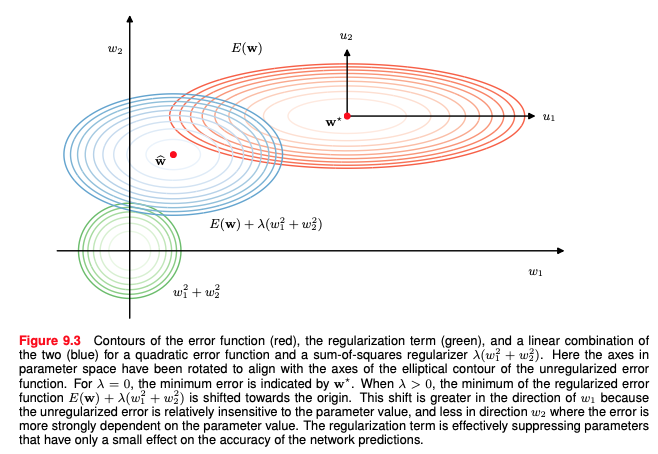
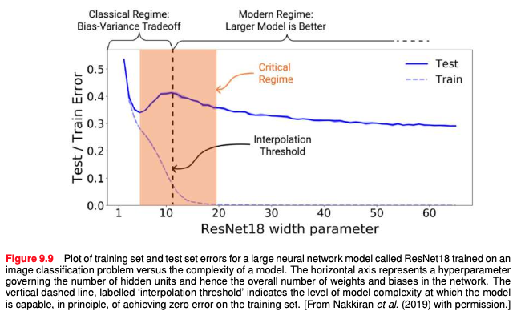
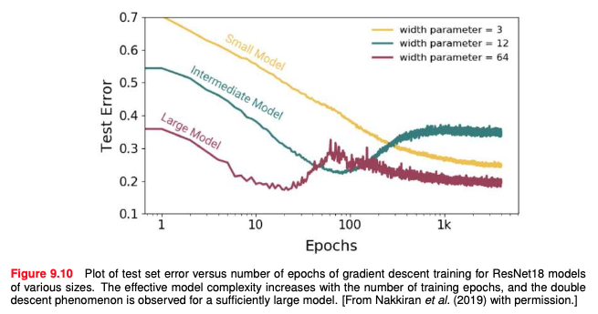

# 9.3 Learning Curves
앞선 내용들 (파라미터 수, 데이터셋 크기, 가중치 감쇠 등)을 통해 **모델의 일반화 성능을 높이는 방법들**을 알아봄
이번 장에선 **학습 과정 자체**를 건들여서 일반화 성능을 향상시키고자 함

일반적으로 Gradient Descent를 통해 손실 함수를 최적화 하면서 훈련 오차가 줄어들지만, **홀드아웃 데이터에서의 오차가 반드시 줄어든다는 보장은 없음**
이를 **학습 곡선 (Learning Curves)를 통해 시각화** 할 수 있음
>학습 곡선 : 훈련 데이터와 검증 데이터에 대한 오차를 반복 횟수에 따라 그래프로 나타낸 것
### Early stopping
네트워크의 복잡도를 제어하기 위해, **조기 종료(Early stopping)을 사용**할 수 있음
>WHY? : 학습 초기에는 데이터의 기본 패턴 위주로 학습하고, 갈수록 고차원의 특성들을 학습해 과도한 복잡도를 가질 수 있음
>
>HOW? : 검증 데이터에 대한 오류가 가장 작은 시점에서 훈련을 멈춤

<!-- ![[9.3.1.png]] -->

위 학습 곡선의 현상은 모델에 **효과적인 파라미터의 수**로 설명될 수 있음
학습이 진행됨에 따라 점진적으로 효과적인 파라미터들이 증가함

<!-- ![[9.3.2.png]] -->

등고선은 같은 오차값을 나타내는 구간을 의미하며, $w^*$는 정규화가 없는 경우의 손실 함수의 최소값
그래디언트의 반대 방향으로 가중치 벡터가 이동함
**조기 종료는 이를 중간에 멈추는 것**으로, $\hat{w}$로 나타냄
이는 **가중치 감쇠를 적용한 결과와 비슷**한 효과를 얻음을 알 수 있음 (아래는 가중치 감쇠로 얻어진 $\hat{w}$를 표현한 그림 9.3)
<!-- ![[9.2.3.png]] -->

**학습률과 반복 횟수의 곱($\tau \eta$)이 정규화 계수의 역수**처럼 동작한다고 볼 수 있음
>$\tau \eta$가 작을수록 학습이 덜 진행되어 $w$의 크기가 작게 유지됨 (강한 정규화)
>$\tau \eta$가 클수록 학습이 많이 진행되어 $w$의 크기가 커짐 (약한 정규화)
### Double descent
편향 분산 트레이드오프(bias-variance trade-off)에 따르면
- 모델의 파라미터의 수가 적을 경우 높은 편향으로 인해 오차가 커짐
- 파라미터의 수가 증가하면 모델의 표현력이 증가해 오차가 줄어듦
- 파라미터의 수가 너무 많아지면 과적합으로 높은 분산을 가져 오차가 다시 커짐
>즉, 훈련 데이터에 대해 너무 큰 모델(너무 많은 파라미터의 수)은 일반적으로 성능이 나쁠 것
>따라서 파라미터의 수를 데이터셋 크기에 맞춰야 한다는 전통적인 통계학의 관점이 생김

근데 현대 딥러닝 모델은 **위의 전통적인 기대와는 다른 현상**을 보임
- 딥러닝 모델의 성능은 파라미터의 수가 데이터셋 크기를 훨씬 초과해도 우수함 [Zhang et al., 2016](https://arxiv.org/pdf/1611.03530)
- 훈련 오차가 0이어도(훈련 데이터를 다 맞추어도) 테스트 데이터에서 좋은 일반화 성능을 보이는 경우가 많음

위 현상을 둘다 표현하기 위해 학습 곡선을 그려보면 **더블 디센트(double descent)** 라는 현상이 발생함 ([Belkin et al., 2019](https://arxiv.org/pdf/1812.11118))
- 모델의 복잡도에 따른 학습 곡선에서 **테스트 오차가 두 번 감소**하는 현상
- 초기엔 편향 분산 트레이드오프가 적용되고, 다시 오차가 줄어드는 구간이 생김

<!-- ![[9.3.4.png]] -->

위 그림은 ResNet18의 사례를 가져온 것임
파라미터의 개수가 늘어남에 따라(모델의 복잡도가 늘어남에 따라) 학습 곡선의 변화를 나타냄

2번째로 테스트 오차가 줄어드는 순간은 대략 모델의 파라미터의 수가 훈련 데이터를 정확히 맞출 수 있을 정도로 충분히 많아질 때 발생함 (Belkin et al., 2019)
[Nakkiran et al., 2019](https://arxiv.org/pdf/1912.02292)에선 모델이 완벽한 적합을 달성할 수 있는 최대 데이터의 크기를 **효과적인 모델 복잡도(effective model complexity)** 라고 정의함
효과적인 모델 복잡도가 훈련 데이터의 데이터 포인트 수를 초과할 때 더블 디센트가 발생한다고 할 수 있음

<!-- ![[9.3.5.png]] -->

조기 종료에서도 모델이 충분히 크면 더블 디센트 현상을 관찰할 수 있음

이러한 특성은 **SGD의 암묵적 편향 때문**임 (대개 실험적으로 확인됐음)
1. 가중치 벡터의 노름이 작은 방향으로 해을 찾음 (L2 정규화와 비슷)
2. 손실이 급변하지 않는 곳에서 해를 찾음

정규화 항이 손실 함수에 추가되어도 더블 디센트를 확인할 수 있음 ([Yilmaz and Heckel, 2022](https://arxiv.org/pdf/2206.01378))

더블 디센트를 반대로 생각해보면 **훈련 데이터의 크기를 늘리면 오히려 성능이 감소**할 수 있음
# 9.4 Parameter Sharing
네트워크의 복잡도를 줄이는 또 다른 방법
**가중치들을 그룹을 묶어 모두 같은 가중치 값**을 가지게 함
이를 가중치 공유(weight sharing), 파라미터 공유(parameter sharing), 파라미터 묶기(parameter tying)라고 함
이는 **네트워크의 연결 수보다 자유도가 적다**는 의미임
보통 **inductive bias를 네트워크에 반영**하기 위해 쓰이며 CNN에서 더 자세한 설명을 함
### Soft weight sharing
그룹에 대해 모두 같은 가중치 값을 가지게 하기보단 **비슷한 값을 갖도록**하는 정규화 항을 도입함 ([Nowlan and Hinton, 1992](https://arxiv.org/pdf/1702.04008))

1. 우선 가중치에 대한 확률 분포를 가우시안 혼합 모델로 정의
$$p(\mathbf{w})=\prod_i\left\{\sum_{j=1}^K\pi_j\mathcal{N}(w_i|\mu_j,\sigma_j^2)\right\}$$
2. 해당 분포에 negative log를 취하고 이를 정규화 항으로 사용해 손실 함수에 포함
$$\Omega(\mathbf{w})=-\sum_i\ln\left(\sum_{j=1}^K\pi_j\mathcal{N}(w_i|\mu_j,\sigma_j^2)\right)$$
3. 전체 손실 함수는 다음과 같음 ($\lambda$는 정규화 계수)
$$\widetilde{E}(\mathbf{w})=E(\mathbf{w})+\lambda\Omega(\mathbf{w})$$
4. 가중치에 대한 기울기 계산 ($\gamma_j(w_i)$는 각 가우시안 성분에 대한 posterior)
   이를 통해 각 가중치가 가우시안의 중심인 $\mu_j$로 이동하도록 함
$$\frac{\partial\widetilde{E}}{\partial w_{i}}=\frac{\partial E}{\partial w_{i}}+\lambda\sum_{j}\gamma_{j}(w_{i})\frac{(w_{i}-\mu_{j})}{\sigma_{j}^{2}}$$
$$\gamma_j(w_i)=\frac{\pi_j\mathcal{N}(w_i|\mu_j,\sigma_j^2)}{\sum_k\pi_k\mathcal{N}(w_i|\mu_k,\sigma_k^2)}$$
5. 평균 $\mu_j$에 대한 기울기 계산
   $\mu_j$가 각 가중치들의 평균으로 이동하도록 함
$$\frac{\partial\widetilde{E}}{\partial\mu_j}=\lambda\sum_i\gamma_j(w_i)\frac{(\mu_j-w_i)}{\sigma_j^2}$$
6. 분산 $\sigma^2_j$에 대한 기울기 계산 (로그 변환으로 계산 $\sigma_j^2=\exp(\xi_j)$)
   분산이 가중치들의 제곱 차이의 평균으로 수렴하도록 함
$$\frac{\partial\widetilde{E}}{\partial\xi}=\frac{\lambda}{2}\sum_{i}\gamma_{j}(w_{i})\left(1-\frac{(w_{i}-\mu_{j})^{2}}{\sigma_{j}^{2}}\right)$$
7. 혼합 계수 $\pi_j$에 대한 기울기 계산 (제약 조건 처리를 위해, 소프트 맥스 함수 사용)
- 제약조건
$$\sum_j\pi_j=1,\quad0\leqslant\pi_i\leqslant1$$
- 소프트 맥스 ($\eta$는 혼합계수가 확률적 의미를 갖게하는 보조 변수)
$$\pi_j=\frac{\exp(\eta_j)}{\sum_{k=1}^K\exp(\eta_k)}$$
- 기울기 계산
$$\frac{\partial\widetilde{E}}{\partial\eta_j}=\lambda\sum_i\{\pi_j-\gamma_j(w_i)\}$$

이러한 소프트 가중치 공유(soft weight sharing)는 비지도 학습인 생성 모델과 지도 학습인 판별 모델의 결합에서 활용될 수 있음

- 생성 모델 : 레이블이 없는 데이터를 사용함
- 판별 모델 : 레이블이 있는 데이터를 사용해, 더 잘 일반화 됨
>두 모델의 파라미터를 소프트하게 묶어 일반화 성능을 얻으면서 레이블이 없는 데이터에서도 학습 가능함

