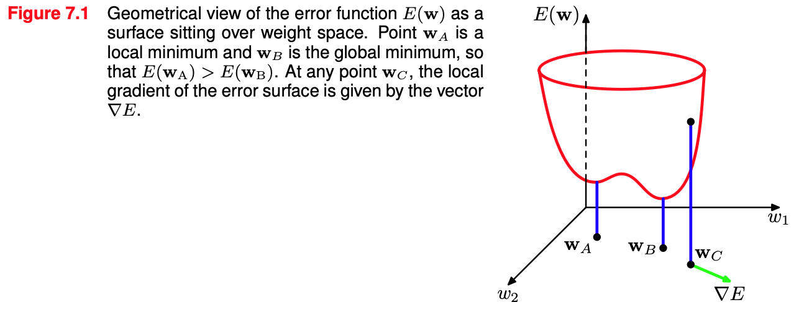
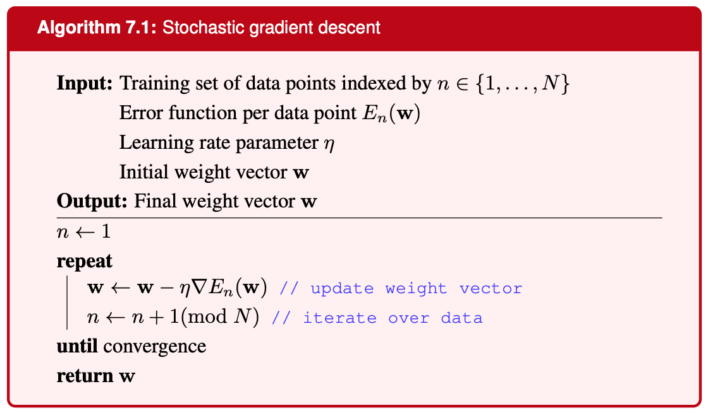
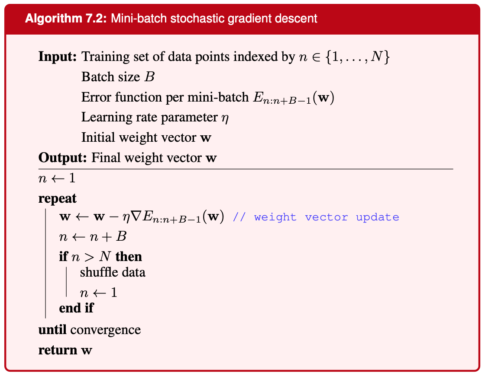

# 지난 이야기...
 신경망은 매우 넓고 유연한 함수의 클래스
 >유연함 : Universal Approximation Theorem (충분히 복잡한 신경망은 거의 모든 함수를 근사)   
 >클래스 : 특정 구조나 성질을 공유하는 것들의 집합

**계층적 표현(hierarchical representations)** : 데이터를 점점 추상적인 수준으로 표현 (간단->복잡)

**귀납적 편향(Inductive Bias)** : 데이터를 학습할 때 어떤 규칙이나 구조를 선호하게 만드는 특성 (ex. CNN의 필터를 통한 지역적 특성 학습, RNN의 순서 구조 학습)

신경망의 오류함수를 최적화하기 위해 MLE를 사용하는 방법을 알아봤는데 이는 비효율적임

이번 장에선 매개변수(가중치와 편향)의 적절한 설정을 찾는 작업에 대해 알아봄
>기울기(Gradient) 정보를 사용하면 훨씬 효율적이며, 역전파(backpropagation)을 사용함   
>따라서 오류함수와 신경망에 쓰이는 함수들이 미분가능해야함
# 7.1 Error Surfaces
훈련의 목표 : 신경망이 효과적인 예측을 하는 가중치와 편향을 찾는 것

오류함수는 가중치 공간에서 보면 하나의 표면으로 생각할 수 있음   

$\mathbf{w}$에서 $\mathbf{w}+\delta\mathbf{w}$로 이동 시 오류 함수의 변화량 : $\delta E\simeq\delta\mathbf{w}^{\mathrm{T}}\nabla E(\mathbf{w})$
즉, $\delta\mathbf{w}$ 방향으로의 $E(\mathbf{w})$ 변화량을 의미   
$\nabla E(\mathbf{w})$는 오류 함수가 가장 크게 증가하는 방향을 가리킴 (기울기)   
따라서 오류를 줄이려면 반대 방향으로 움직여서 $\nabla E(\mathbf{w})=0$인 점에 도달할 수 있음   
우리가 원하는 건 **global minimum**이지만, 오류함수는 매개변수에 비선형적으로 의존하므로 **local minimum**이 많이 존재   
local mimimum이 많지만 기울기 기반 최적화 방법은 **실제로 잘 작동**함   

### 7.1.1 Local quadratic approximation
최적화 문제에 대한 통찰을 어딕 위해 국소 이차 근사를 고려
2차항까지 오류함수 테일러 전개는 다음과 같음
$$E(\mathbf{w})\simeq E(\widehat{\mathbf{w}})+(\mathbf{w}-\widehat{\mathbf{w}})^{\mathrm{T}}\mathbf{b}+\frac{1}{2}(\mathbf{w}-\widehat{\mathbf{w}})^{\mathrm{T}}\mathbf{H}(\mathbf{w}-\widehat{\mathbf{w}})$$
- $\mathbf{b}\equiv\left.\nabla E\right|_{\mathbf{w}=\widehat{\mathbf{w}}}$ : $\mathbf{w}$에서 오류함수의 기울기 (가장 빠르게 변화하는 방향과 크기)
- $\mathbf{H}(\widehat{\mathbf{w}})=\left.\nabla\nabla E(\mathbf{w})\right|_{\mathbf{w}=\widehat{\mathbf{w}}}$ : 해시안 행렬, $\mathbf{w}$에서 오류함수의 곡률
- 신경망의 매개변수가 $W$개 있다면 $\mathbf{w}$와 $b$는 길이가 $W$인 벡터, $\mathbf{H}$는 $W \times W$ 행렬

위 식을 사용한 오류 함수의 기울기에 대한 근사는 다음과 같음
$$\nabla E(\mathbf{w})=\mathbf{b}+\mathbf{H}(\mathbf{w}-\widehat{\mathbf{w}})$$

최소점 근처 $\mathbf{w}^{\star}$에서 이차 근사는 다음과 같음
$$E(\mathbf{w})=E(\mathbf{w}^{\star})+\frac{1}{2}(\mathbf{w}-\mathbf{w}^{\star})^{{\mathrm{T}}}\mathbf{H}(\mathbf{w}-\mathbf{w}^{\star})$$
해시안 행렬의 고윳값과 고유벡터를 이용해 식을 정리하면 다음과 같은 결론을 얻을 수 있음
($\mathbf{w}^{\star}$이 최소점 근처이므로 $\nabla E=0$임을 가정)
- 모든 고윳값이 양수 : $\mathbf{w}^{\star}$는 local minimum
- 모든 고윳값이 음수 : $\mathbf{w}^{\star}$는 local maximum
- 양수와 음수가 혼재 : $\mathbf{w}^{\star}$는 saddle point
>local minimum에 도달하기 위한 조건은 **기울기가 0이고 헤시안 행렬이 양의 정부호**여야 함   
>[관련 블로그](https://angeloyeo.github.io/2021/12/20/positive_definite.html#%EC%96%91%EC%9D%98-%EC%A0%95%EB%B6%80%ED%98%B8%EC%99%80-%ED%97%A4%EC%8B%9C%EC%95%88-%ED%96%89%EB%A0%AC)
# 7.2 Gradient Decent Optimization
복잡한 신경망에서 정의된 오류함수에서 $\nabla E=0$인 해를 분석적으로 찾는건 거의 불가능하므로 **반복적인 수치적 절차**를 사용해야 함

대부분의 알고리즘에선 가중치 초기값을 설정하고 가중치 공간에서 아래와 같이 반복적으로 이동함
$$\mathbf{w}^{(\tau)}=\mathbf{w}^{(\tau-1)}+\Delta\mathbf{w}^{(\tau-1)}$$
알고리즘 마다 $\Delta\mathbf{w}^{(\tau-1)}$의 선택 방식이 다름
오류 함수가 복잡하므로 초기값에 따라 해가 달라짐   
>다양한 무작위 초기값을 여러번 반복적으로 실행하고 비교할 필요가 있음

### 7.2.1 Use of gradient information
오류함수의 기울기(gradient)는 **역전파(backpropagation)을 사용해 효율적으로 계산**할 수 있음   

만약 기울기 정보를 사용하지 않는다면 $O(W^3)$의 계산 복잡도를 가지지만 역전파를 사용하면 $O(W^2)$로 줄어듦    
(자세한 내용은 책 참고, ~~대충 행렬의 모든 파라미터 $O(W^2)$개를 고려하지 않고 기울기 정보 $O(W)$번만 고려한다는 내용~~)
### 7.2.2 Batch gradient descent
기울기 정보를 사용하는 가장 간단한 방법은 **기울기의 반대 방향으로 조금 이동**시키는 것   
$$\mathbf{w}^{(\tau)}=\mathbf{w}^{(\tau-1)}-\eta\nabla E(\mathbf{w}^{(\tau-1)})$$   
- $\eta>0$은 학습률(learning rate)   
단계마다 오류 함수의 감소율이 가장 큰 방향으로 이동하므로 **경사 하강법(gradient descent)** 라고 불림   
전체 데이터를 다 사용하면 배치 방법(batch methods)이라고 함   
### 7.2.3 Stochastic gradient descent
딥러닝은 매우 큰 데이터셋에서 유리한데 배치 방법은 데이터 포인트가 많으면 비효율적 (기울기 계산이 모든 데이터셋에 대해 이루어짐)   

데이터 포인트가 독립이면 likelihood 기반 오류 함수는 각 데이터 포인트 마다의 합으로 구성됨에 주목하면 다음과 같은 식이 세워짐   
$$E(\mathbf{w})=\sum_{n=1}^NE_n(\mathbf{w})$$
따라서 **한번에 하나의 데이터 포인트에 대해서만 가중치를 업데이트** 하는 방식인 **확률적 경사 하강법(stochastic gradient descent, SGD)** 를 사용   
SGD는 각 데이터 포인트에 대해서 계산하므로 local minimum에서 벗어날 수 있음   
$$\mathbf{w}^{(\tau)}=\mathbf{w}^{(\tau-1)}-\eta\nabla E_n(\mathbf{w}^{(\tau-1)})$$

### 7.2.4 Mini-batches
SGD는 전체 데이터셋에서 계산된 기울기에 노이즈가 많은 추정치를 제공한다는 단점이 존재   
따라서 적절하게 미니배치(mini-batch)라고 하는 **작은 데이터 포인트 집합을 사용**하는 방법   
미니배치를 사용하는 알고리즘도 여전히 SGD라고 불림   

   

미니배치를 선택할 때 하드웨어 아키텍처를 고려해 2의 거듭제곱으로 정하는 경우가 많음(64, 128, 256, ...)   

미니배치를 사용할 땐 연속된 데이터간의 상관관계를 없애기 위해 데이터 포인트를 무작위로 선택해야함   
또한 반복마다 데이터셋을 섞으면 local minimum에서 벗어나는데 도움을 줄 수 있음   

### 7.2.5 parameter initialization
초기화 방법은 최적해에 도달하는데 걸리는 시간과 학습된 신경망의 일반화 성능에 상당한 영향을 미칠 수 있음   
여러 은닉 유닛이나 출력 유닛이 있을 때 모든 파라미터가 동일한 값으로 설정되면 파라미터들이 모두 동일하게 업데이트 됨   
따라서 중요한 사항은 **대칭을 깨뜨려야한다**는 점임    
$[-\epsilon, \epsilon]$에서 균등분포나, 평균 0에 표준편차를 $\epsilon$으로 가지는 정규분포에서 뽑기도 함   
가장 대중적인 방법은 **He initialization**   
이는 ReLU를 위해 만들어진 초기화 방법임   
앞 layer의 유닛이 $n$개면 표준편차가 $\frac{2}{\sqrt{n}}$인 정규분포를 사용해서 초기화 하는 방식   
[가중치 초기화관련 블로그](https://velog.io/@cha-suyeon/DL-%EA%B0%80%EC%A4%91%EC%B9%98-%EC%B4%88%EA%B8%B0%ED%99%94Weight-Initialization-)   

또 다른 중요한 초기화 기법은 **전이 학습(transfer learning)** 기법으로, 다른 작업에서 네트워크를 학습 시킨 후 얻은 값을 사용하거나 다양한 형태의 비지도 학습을 활용해 파라미터를 초기화 하는 방법임
