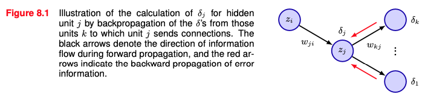
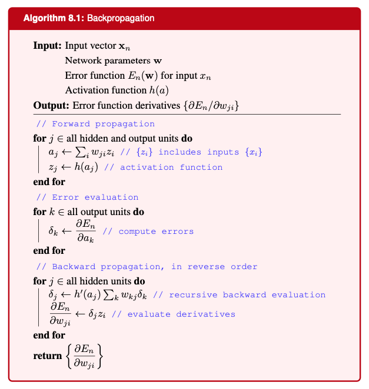

피드포워드 신경망의 오류 함수 $E(w)$의 기울기를 계산하는 효율적인 방법
> error backpropagation 또는 backprop

과거에는 방정식을 직접 세우고 구현했는데 요즘엔 자동 미분으로 작동함

# 8.1 Evaluation of Gradients
오류 함수는 아래와 같이 각 데이터 포인트에 대한 합으로 정의되지만, 책에선 하나의 항 $\nabla E_n(w)$에 대해 계산하는 문제를 다룸
$$E(\mathbf{w})=\sum_{n=1}^NE_n(\mathbf{w})$$
### 8.1.1 Single-layer networks
입력변수의 선형결합으로 이루어지는 간단한 선형 모델을 고려함
$$y_k=\sum_iw_{ki}x_i$$

오류 함수는 다음과 같음
$$E_n=\frac{1}{2}\sum_k(y_{nk}-t_{nk})^2$$

가중치에 대한 오류 함수의 기울기는 다음과 같음
$$\frac{\partial E_n}{\partial w_{ji}}=(y_{nj}-t_{nj})x_{ni}$$
출력의 끝과 관련된 값과 입력의 끝의 곱으로 간단히 계산됨
이렇게 간단한 결과가 다층 피드포워드 네트워크로 어떻게 확장되는지 앞으로 다룸
### 8.1.2 General feed-forward networks
일반적인 피드포워드 네트워크는 아래와 같이 구성됨
$$a_j=\sum_iw_{ji}z_i$$
$$z_j=h(a_j)$$
여기서 $h$는 비선형 활성화 함수로, 선형 모델과는 차이가 있음

위 과정을 순차적으로 적용해 네트워크의 모든 은닉 유닛과 출력 유닛의 활성화를 계산함
정보를 네트워크를 통해 앞으로 흐르게 한다는 의미에서 순전파(forward propagation)라고 불림

연쇄 법칙(chain rule)을 적용해 가중치에 대한 오류 함수의 기울기는 다음과 같이 쓸 수 있음
$$\frac{\partial E_n}{\partial w_{ji}}=\frac{\partial E_n}{\partial a_j}\frac{\partial a_j}{\partial w_{ji}}$$
이때 다음의 유용한 표기를 도입하며, $\delta$는 오류라고 불림
$$\delta_j\equiv\frac{\partial E_n}{\partial a_j}$$

가중치에 대한 오류 함수의 기울기의 뒷 항은 $\frac{\partial a_j}{\partial w_{ji}}=z_i$이므로 다음과 같이 다시 쓸 수 있음
$$\frac{\partial E_n}{\partial w_{ji}}=\delta_jz_i$$
필요한 도함수가 단순히 가중치의 출력 끝의 $\delta$ 값과 입력 끝의 $z$ 값을 곱한 것으로 얻어짐 (선형 모델과 같은 결과)

출력 유닛의 경우 $\delta_k=y_k-t_k$이며, 은닉 유닛의 경우는 연쇄 법칙을 한번 더 적용해야함
$$\delta_j\equiv\frac{\partial E_n}{\partial a_j}=\sum_k\frac{\partial E_n}{\partial a_k}\frac{\partial a_k}{\partial a_j}$$
합은 유닛 $j$ 가 연결을 보내는 모든 유닛 $k$에 대해 이루어짐 (아래 그림 참고)

다시 아까 정의한 $\delta_j$를 이용하고 네트워크 수식들을 사용하면 아래와 같은 공식을 얻을 수 있음
$$\delta_j=h^{\prime}(a_j)\sum_kw_{kj}\delta_k$$
출력 유닛에 대한 $\delta$를 알고 있기에 재귀적으로 적용해 모든 은닉 유닛에 대한 $\delta$ 값을 계산할 수 있음

아래는 이에 대한 알고리즘을 설명하는 그림

배치 방법에서는 오류 함수의 기울기를 구하기 위해 훈련 세트의 각 데이터 포인트에 대해 위 단계를 반복해, 배치에 있는 모든 데이터 포인트에 대해 합산함
$$\frac{\partial E}{\partial w_{ji}}=\sum_n\frac{\partial E_n}{\partial w_{ji}}$$
위 과정에서는 모든 유닛의 활성화 함수가 동일하다고 가정했었지만 개별적이어도 쉽게 일반화 가능
### 8.1.3 A simple example
- 출력 유닛 : $y_k = a_k$
- 은닉 유닛 : $h(a) ≡ tanh(a)$
  $tanh$를 사용하면 도함수가 아래와 같이 간단하게 표현됨
$$h^{\prime}(a)=1-h(a)^2$$
- 오류 함수
$$E_n=\frac{1}{2}\sum_{k=1}^K(y_k-t_k)^2$$
- 순전파
$$\begin{gathered}
a_{j}=\sum_{i=0}^{D}w_{ji}^{(1)}x_{i} \\
z_{j}=\quad\tanh(a_{j}) \\
y_{k}=\sum_{j=0}^{M}w_{kj}^{(2)}z_{j}
\end{gathered}$$
$D$는 입력 벡터의 차원, $M$은 은닉 유닛의 총 개수, 편향을 위해 $x_0=z_0=1$

- 출력 유닛에 대한 $\delta$
$$\delta_k=y_k-t_k$$
- 은닉 유닛에 대한 $\delta$
$$\delta_j=(1-z_j^2)\sum_{k=1}^Kw_{kj}^{(2)}\delta_k$$
- 첫 레이어와 두번째 레이어의 가중치에 대한 오류 함수의 도함수
$$\frac{\partial E_n}{\partial w_{ji}^{(1)}}=\delta_jx_i,\quad\frac{\partial E_n}{\partial w_{kj}^{(2)}}=\delta_kz_j$$
### 8.1.4 Numerical differentiation
역전파에서 가장 중요한 것 중 하나는 계산 효율성

네트워크의 총 가중치와 편향의 수 : $W$
오류함수 계산 : $O(W)$
	가중치의 수가 유닛의 수보다 훨씬 많은 경우를 가정

도함수 계산을 위한 방법 **1. 유한 차분 (finite differneces)**
ㅁㅁㅁㅁ (8.24)
$\epsilon$은 매우 작은 값이며 작을수록 근사가 정확하지만 round offf 문제가 발생할 수 있음

도함수 계산을 위한 방법 **2. 중앙 차분(central differences)**
ㅁㅁㅁㅁ (8.25)
중앙차분을 하면 더욱 정확하게 계산할 수 있지만 계산량이 약 2배가 됨

아래 그림은 유한 차분과 중앙차분을 비교한 결과
![[8.1.3.png]]

**수치 미분**(유한 차분, 중앙 차분)의 **문제점** : 순전파에서 $O(W)$의 연산을 네트워크의 가중치의 개수인 $W$번 반복해서 계산해야하므로 $O(W^2)$가 됨

수치 미분은 역전파를 직접 구현하거나 자동 미분을 사용해 구한 도함수의 값의 정확성을 검증할 수 있는 방법으로 쓰일 수 있음

