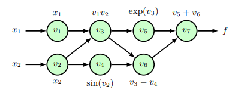
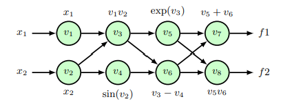

# Auto Differentiation

- 수치적 미분에는 문제가 많음 (저번시간에 배움)
### Symbolic Differentiation
- 소프트 웨어를 사용해 미분 공식을 자동 유도하는 방식
- 수치적 오류를 방지할수 있음
- 하지만 제어흐름을 포함하는 표현을 처리할 수 없다는 단점이 있음 (if나 for 같은거)
#### symbolic 작동 과정

1. **입력 함수 표현**:
    - 함수가 닫힌 수학적 표현(예: $f(x)=x^2+3x+2$으로 주어집니다.
2. **미분 규칙 적용**:
    - 각 구성 요소에 대해 미분 규칙을 재귀적으로 적용합니다.
    - 예를 들어$f(x)=x^{2}$의 경우 체인 룰을 적용해 $f^′(x)=2x$를 계산합니다.
3. **수식 단순화**:
    - 최종적으로 결과 수식을 단순화하려고 시도합니다. 하지만 항상 최적화된 형태로 변환되지는 않으며, 중복 계산이 포함될 수 있습니다.
4. **결과 출력**:
    - 미분 결과는 기계적으로 생성된 수학적 표현으로 반환됩니다.
### Auto Differentiation
- 코드에서 기울기를 동시에 계산하는 방벙
- 중간 변수를 재활용해 중복 계산을 피할 수 있음
- 제어흐름을 처리 가능
- 그래프를 활용하여 미분을 진행

### Forward Auto Differentiation
- Primal Variable : 입력 변수
- Tangent Variable : 기울기변수
- $$\dot{v}_{i}=\frac{\partial v_{i}}{\partial x_{1}}$$
#### 예시

$$f(x_1,x_2)=x_1x_2+\exp(x_1x_2)-\sin(x_2)$$

Primal Variable 계산:
$$\begin{aligned}&\cdotp v_{1}=x_{1},v_{2}=x_{2}\\&\cdot v_{3}=v_1v_2\\&\cdotp v_{4}=\sin(v_2)\\&\cdotp v_{5}=\exp(v_3)\\&\cdotp v_{6}=v_3-v_4\\&\cdotp v_{7}=v_5+v_6\end{aligned}$$
tangent Variable 계산
$$\begin{aligned}&\cdot\dot{v}_{1}=1,\dot{v}_{2}=0\\&\cdot\dot{v}_{3}=v_1\dot{v}_2+\dot{v}_1v_2\\&\cdot\dot{v}_{4}=\dot{v}_2\cos(v_2)\\&\cdot\dot{v}_{5}=\dot{v}_3\exp(v_3)\\&\cdotp v_{6}=\dot{v}_3-\dot{v}_4\\&\cdot\dot{v}_{7}=\dot{v}_5+\dot{v}_6\end{aligned}$$
- K개의 입력력과 D개의 출력이 있을때 K>D일때 효율적임
- 하지만 대부분의 딥러닝 문제는 D가 크기 때문에 비효율적이다
- 자코비 행렬을 통해 계산이 가능 하지만 보통 딥러닝에서는 역방향이 더 효율적이기 때문에 사용하지 않음

### Reverse-mode automatic differentiation
- 다중 출력과 같은 여러 식에 대한 미분을 진행 해야할때 계산양을 줄일 수 있음
- Primal Variable : 입력 변수
- Adjoint Variable : 기울기변수
- $$\bar{v}_i=\frac{\partial f}{\partial v_i}$$
- Hessian-Vector Product 계산에도 사용
	- 복잡도는 $O(W^2)$ , W는 파라미터 개수
#### 예시
$$\begin{gathered}f_1(x_1,x_2)=x_1x_2+\exp(x_1x_2)-\sin(x_2)\\f_2(x_1,x_2)=(x_1x_2-\sin(x_2))\cdot\exp(x_1x_2)\end{gathered}$$

Primal Variable 계산:
$$\begin{aligned}&\cdotp v_{1}=x_{1},v_{2}=x_{2}\\&\cdot v_{3}=v_1v_2\\&\cdotp v_{4}=\sin(v_2)\\&\cdotp v_{5}=\exp(v_3)\\&\cdotp v_{6}=v_3-v_4\\&\cdotp v_{7}=v_5+v_6\end{aligned}$$
Adjoint Variable 계산:
$$\begin{aligned}&\overline{v}_{7}=1\\&\overline{v}_{6}=\overline{v}_{7}\\&\overline{v}_{5}=\overline{v}_{7}\\&\overline{v}_{4}=-\overline{v}_{6}\\&\overline{v}_{3}=\overline{v}_{5}v_{5}+\overline{v}_{6}\\&\overline{v}_{2}=\overline{v}_{2}v_{1}+\overline{v}_{4}\cos(v_{2})\\&\overline{v}_{1}=\overline{v}_{3}v_{2}.\end{aligned}$$

