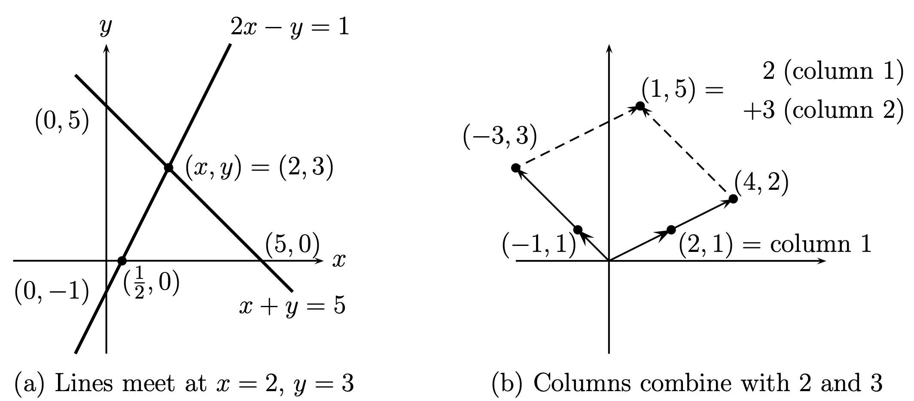
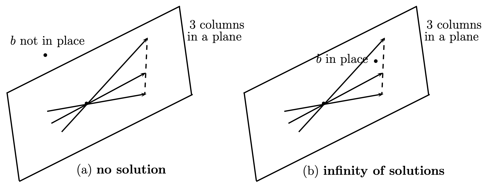
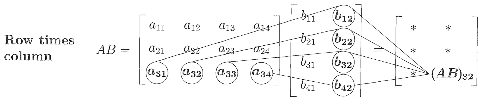

# Matrices and Gaussian Elimination

## 1.1 Introduction
선형대수의 중심 문제 : 연립 일차 방정식 풀기

방정식간 뺄셈(Elimination)으로 구하는 방식은 방정식이 많아지면 (ex. 1000개) 구하기 어려워짐
따라서 Ch.1에선 Gaussian Elimination, Ch.4에선 Cramer's Rule을 배울 것

## 1.2 The Geometry of Linear Equations
연립 일차 방정식은 행으로 볼 수도, 열으로 볼 수도 있음

$$\begin{aligned}\begin{array}{ccccccc}2x&-&y&=&1\\x&+&y&=&5\end{array}\end{aligned}$$

$$x\begin{bmatrix}2\\1\end{bmatrix}+y\begin{bmatrix}-1\\1\end{bmatrix}=\begin{bmatrix}1\\5\end{bmatrix}$$

### Column Vectors and Linear Combinations
**Linear Combination** : 각 벡터들에 상수가 곱해지고, 그 항들을 더한 식
$$\mathbf{1}\begin{bmatrix}2\\4\\-2\end{bmatrix}+\mathbf{1}\begin{bmatrix}1\\-6\\7\end{bmatrix}+\mathbf{2}\begin{bmatrix}1\\0\\2\end{bmatrix}=\begin{bmatrix}5\\-2\\9\end{bmatrix}$$
결국 연립 선형 방정식의 해는 등식을 만족하는 열들의 Linear Combination을 찾는 것과 같음
### Singular Case
해가 없거나, 무수히 많은 해를 가지는 경우

이는 모든 열들이 같은 평면 위에 놓인 경우와 동치

## 1.3 An Example of Gaussian Elimination
위부터 차례대로 방정식의 곱에서 다른 방정식들을 빼며(**Elimination**) pivot을 만들고,
아래서부터 해를 대입(**back-substitution**)하며 다음 해를 구하는 방식

### Elimination
$$\begin{aligned}\begin{array}{ccccccc}
&2u&+&\nu&+&w&=&5\\
&4u&-&6\nu&&&=&-2\\
&-2u&+&7\nu&+&2w&=&9 
\end{array}\end{aligned}$$

$$
\begin{aligned}\begin{array}{ccccccc}
2u&+&\nu&+&w&=&5\\
&-&8\nu&-&2w&=&-12\\
&&8\nu&+&3w&=&14
\end{array}\end{aligned}$$

first pivot : 2, second pivot : -8

$$\begin{aligned}\begin{array}{ccccccc}
2u&+&\nu&+&w&=&5\\
&-&8\nu&-&2w&=&-12\\
&&&&1w&=&2
\end{array}\end{aligned}$$

first pivot : 2, second pivot : -8, last pivot : 1

$$\begin{bmatrix}2&1&1&5\\4&-6&0&-2\\-2&7&2&9\end{bmatrix}\longrightarrow\begin{bmatrix}2&1&1&5\\0&-8&-2&-12\\0&8&3&14\end{bmatrix}\longrightarrow\begin{bmatrix}2&1&1&5\\0&-8&-2&-12\\0&0&1&2\end{bmatrix}$$
위와 같이 간단히 Elimination을 나타낼 수 있음

### back-substitution
마지막 행 : $w = 2$
두번째 행 : $w = 2,\ v = 1$
첫번째 행 : $w = 2,\ v = 1, \ u=1$

### The Breakdown of Elimination
- pivot이 0일 때 : 방정식의 순서를 바꾸면 해결될 수 있음 (안되면 Singular)

## 1.4 Matrix Notation and Matrix Multiplication
### Multiplication of a Matrix and a Vector
- **Matrix form** $Ax=b$
  연립 일차 방정식은 다음과 같은 행렬 형식으로 표현됨
$$\begin{bmatrix}2&1&1\\4&-6&0\\-2&7&2\end{bmatrix}\begin{bmatrix}u\\v\\w\end{bmatrix}=\begin{bmatrix}5\\-2\\9\end{bmatrix}$$

- **inner product**
  행 곱하기 열이 행렬곱의 기초이며, 이를 내적(**inner product**)이라고 함
$$\begin{bmatrix}2&1&1\end{bmatrix}\begin{bmatrix}1\\1\\2\end{bmatrix}=\begin{bmatrix}2\cdot1+1\cdot1+1\cdot2\end{bmatrix}=\begin{bmatrix}5\end{bmatrix}$$

- $Ax$ by rows
  행렬곱은 행과 열, 두가지 관점으로 이해할 수 있음
$$\begin{bmatrix}1&1&6\\3&0&1\\1&1&4\end{bmatrix}\begin{bmatrix}2\\5\\0\end{bmatrix}=\begin{bmatrix}1\cdot2+1\cdot5+6\cdot0\\3\cdot2+0\cdot5+3\cdot0\\1\cdot2+1\cdot5+4\cdot0\end{bmatrix}=\begin{bmatrix}7\\6\\7\end{bmatrix}$$

- $Ax$ by columns
$$2\begin{bmatrix}1\\3\\1\end{bmatrix}+5\begin{bmatrix}1\\0\\1\end{bmatrix}+0\begin{bmatrix}6\\3\\4\end{bmatrix}=\begin{bmatrix}7\\6\\7\end{bmatrix}$$
  

- **Sigma notation**
  $i$번째 요소를 다음과 같이 표현 가능
$$\text{The }i\text{th component of }Ax\mathrm{~is~}\sum_{j=1}^na_{ij}x_j.$$

### The Matrix Form of One Elimination Step
- **Identity matrix** and **Elementary matrix**
  Identity matrix : 곱했을 때, 그대로인 행렬
  Elementary matrix : 곱했을 때, elimination과 같은 효과를 내는 행렬
  $$ I=\begin{bmatrix}1&0&0\\0&1&0\\0&0&1\end{bmatrix} \ \text{has}\  Ib=b \quad E_{31}=\begin{bmatrix}1&0&0\\0&1&0\\-\ell&0&1\end{bmatrix} \ \text{has} \ E_{31}b=\begin{bmatrix}b_1\\b_2\\b_3-\ell b_1\end{bmatrix}$$
### Matrix Multiplication
- Multiplication by columns
  아래가 성립하려면 $A$의 열의 개수와 $B$의 행의 개수가 같아야 함
$$AB=A\begin{bmatrix}b_1\\b_2\\b_3\end{bmatrix}=\begin{bmatrix}Ab_1\\Ab_2\\Ab_3\end{bmatrix}$$

- 몇가지 성질
  1. $(EA)x = E(Ax)$
  2. $(AB)_{ij}=(\text{row }i\text{ of }A)\text{ times }(\text{column }j\text{ of }B)$
  3. $\text{column }j\text{ of }AB=A\text{ times }(\text{column }j\text{ of }B)$
  4. $\text{row i of }AB=(\text{row }i\text{ of }A)\text{ times }B$
  5. $A(B+C)=AB+AC\quad\mathrm{and}\quad(B+C)D=BD+CD$
  6. $\text{Usually}\ FE\neq EF$

