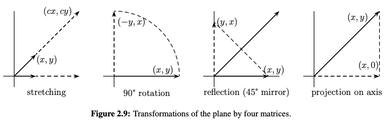

# 2.4 The Four Fundamental Subspaces
앞선 장에서 basis를 정의하긴 했지만 어떻게 찾는지는 안알려줌
subspace의 명시적 표현부터 시작해서 basis를 계산해보자
### Subspace를 표현하는 방법
1. space를 span하는 벡터들의 집합 (ex. 열들이 column space를 span)
   필요없는 벡터가 포함될수 있음 (dependent columns)
2. 조건을 만족하는 벡터들의 집합 (ex. $Ax=0$을 만족하는 모든 벡터들은 Nullspace에 속함)
   반복되는 조건이 추가될수도 있음 (dependent rows)
> 따라서 단순히 보기만 해서는 basis를 알 수 없고, 체계적인 절차가 필수적임
> $A$에 소거법을 적용해 사다리꼴 행렬 $U$나 reduced $R$로 만들면 $A$와 관련된 subspace의 basis를 찾을 수 있을 것?
### full rank
1. $r=n$ : left-inverse 존재
2. $r = m$ : right-inverse 존재
3. $r = m = n$ : two-sided inverse 존재 
### four subspaces
#### 1. column space $C(A)$ : rank $r$ 차원
**range**라도도 불림 ($f(x) = Ax$의 범위)
이번엔 $U$와 $A$의 column space가 다르지만 차원은 같음
pivot이 있는 row와 column의 수는 같으므로 column space와 row space의 차원은 같음
> $A$의 pivot columns가 column space의 basis
> $U$의 pivot columns와 $A$의 pivot columns의 순서가 같으므로 쉽게 구함
> Ax= 0 exactly when Ux= 0 **118p 참고**
#### 2. nullspace $N(A)$ : $Ax = 0$을 만족하는 모든 $x$의 집합. $n-r$ 차원
소거법이 해를 바꾸지는 않으므로 $A$의 nullspace는 $U$, $R$의 nullspace와 같음
$Ax=0$에서 $r$개의 방정식만 독립이므로 $n-r$개의 special solutions가 basis가 됨
nullspace는 **kernel**이라고도 불리며, 그 차원은 **nullity**라고 함
> free variable에 하나만 1, 나머진 0을 대입하면서 special solutions(basis)를 찾음

#### 3. row space $C(A^T)$ : $A^T$의 column space로, $A$의 행으로 span됨. $r$ 차원
행들의 모든 조합이므로 사다리꼴 행렬 $U$에 대해서 row space는 명확함
0이 아닌 행들이 basis가 되며 차원은 $r$
기초 행 연산은 rows의 combinations이므로, $A$의 row space와 $U$의 row space는 같음
> $A$의 row space가 알고 싶으면  $U$의 row space를 구하면 됨
#### 4. left nullspace $N(A^T)$ : $A^Ty=0$을 만족하는 모든 $y$의 집합. $m-r$ 차원
> $A^T$의 nullspace 구하는거로 생각

$N(A)$, $C(A^T)$는 $R^n$의 subspace
$N(A^T)$, $C(A)$는 $R^m$의 subspace
> 정의를 생각해보면 간단함. (벡터의 요소 수)

### Fundamental Theorem of Linear Algebra, Part 1
1. $C(A)$ = column space of $A$; dimension $r$
2. $N(A)$ = nullspace of $A$; dimension $n-r$
3. $C(A^T)$ =  row space of $A$; dimension $r$
4. $N(A^T)$ = left nullspace of $A$; dimension $m-r$
### 만약 4가지 subspace가 모두 line이라면?
**책참고**
subspace끼리 수직

### Existence of Inverses
left-inverse와 right-inverse를 둘 다 가지면 두 inverse는 같음 : $B = B(AC) = (BA)C = C$
$m\times n$ 행렬에서
- $r = m$이면 right-inverse $C$ 존재, $Ax=b$가 항상 해를 가짐 ($m \le n$에서 가능)
- $r = n$이면 left-inverse $B$ 존재, 해가 존재할 시 유일함 ($m \ge n$에서 가능)
- $r = m = n$이면 two-sided inverse 존재, 해가 존재하며 유일함 (**square matrix에서만 가능**)
### One-sided inverses
$C = A^T(AA^T)^{-1}$ 
$B = (A^TA)^{-1}A^T$
각 inverse가 존재하면 가능 (Ch.3에서 자세히 다룸)
### square matrix의 inverse
left-inverse가 존재하면 right-inverse 존재, 역 성립
즉, 해의 존재와 유일함이 서로 보장됨
#### invertible 조건
1. 열들이 $R^n$을 span한다면 $Ax=b$가 모든 $b$에 대해 최소 1개의 해를 가짐
2. 열들이 독립이면 $Ax=0$은 $x=0$에서만 성립
자세히 풀면,
1. 행들이 $R^n$을 span
2. 행들이 선형 독립
3. 소거법이 n개의 pivot 가짐
4. 행렬식이 0이 아님
5. $A$의 고윳값이 0이 아님
6. $A^TA$가 positive definite
### Rank가 1인 행렬
$$A=(\mathbf{column})(\mathbf{row})\quad\begin{bmatrix}2&1&1\\4&2&2\\8&4&4\\-2&-1&-1\end{bmatrix}=\begin{bmatrix}1\\2\\4\\-1\end{bmatrix}\begin{bmatrix}2&1&1\end{bmatrix}.$$
모든 rank가 1인 행렬은 $A=uv^T$가 항상 성립
# 2.5 Graphs and Networks
**전자공학에 관련된 내용으로 생략**
# 2.6 Linear Transformations
### Transform
$n$차원 벡터 $x$에 대해 $Ax$
1. stretches 
   $A=\begin{bmatrix}c&0\\0&c\end{bmatrix}$
2. rotation 
   $A=\begin{bmatrix}0&-1\\1&0\end{bmatrix}$
3. reflection (permutation)
   $A=\begin{bmatrix}0&1\\1&0\end{bmatrix}$
4. projection 
   $A=\begin{bmatrix}1&0\\0&0\end{bmatrix}$

### trasformation $T(x)$의 성질
1. 원점을 옮기지 못함 ($A0 = 0\ for\ all\ A$)
2. $A(cx)=c(Ax)$
3. $A(x+y)=Ax+Ay$
> 위 성질들은 matrix에서 기원된 모든 transform에 적용됨
> 따라서 위 성질을 만족하는 transformation을 linear transformation(선형 변환)이라고 부름

### 모든 선형 변환이 matrix로 이어지는가?
**이어짐**
이것이 선형 대수에 대한 접근 방식의 기초
선형 변환은 $n$차원 벡터를 $m$차원 벡터로 변환 가능 -> $m \times n$ matrix와 동일한 작용

### 선형 변환 example (다항식 집합$P^n$에서)
1. 미분 ($P^n$ -> $P^{n-1}$)
$$Ap(t)=\frac d{dt}(a_0+a_1t+\cdots+a_nt^n)=a_1+\cdots+na_nt^{n-1}$$
2. 적분 ($P^{n}$ -> $P^{n+1}$)
$$Ap(t)=\int_0^t(a_0+\cdots+a_nt^n)dt=a_0t+\cdots+\frac{a_n}{n+1}t^{n+1}$$
3. 곱
$$Ap(t)=(2+3t)(a_0+\cdots+a_nt^n)=2a_0+\cdots+3a_nt^{n+1}$$
이렇게 보면 선형 변환이 많아보이지만 대부분의 transform은 linear하지 않음 (ex. 제곱, +1)
### Transformations Represented by Matrices
#### Linearity
$$\mathrm{If}\quad x=c_1x_1+\cdots+c_nx_n\quad\mathrm{then}\quad Ax=c_1(Ax_1)+\cdots+c_n(Ax_n).$$
선형성은 다음을 보장함 : **basis에 대한 백터들의 $Ax$를 알면, 전체 공간에 대한 $Ax$를 알 수 있음**
**미분 적분 예시 책 참고**
### Rotations $Q$, Projections $P$, Reflections $H$
#### Rotation
코사인 사인을 통해 각도로 표현 가능
- inverse ($inverse\ of\ Q_\theta == Q_{-\theta}$)
$$Q_\theta Q_{-\theta}=\begin{bmatrix}c&-s\\s&c\end{bmatrix}\begin{bmatrix}c&s\\-s&c\end{bmatrix}=\begin{bmatrix}1&0\\0&1\end{bmatrix}$$
- square ($Q_\theta Q_\theta == Q_{2\theta}$)
$$Q_\theta^2=\begin{bmatrix}c&-s\\s&c\end{bmatrix}\begin{bmatrix}c&-s\\s&c\end{bmatrix}=\begin{bmatrix}c^2-s^2&-2cs\\2cs&c^2-s^2\end{bmatrix}=\begin{bmatrix}\cos2\theta&-\sin2\theta\\\sin2\theta&\cos2\theta\end{bmatrix}$$

- product ($Q_\theta Q_\varphi == Q_{\theta+\varphi}$)
$$Q_\theta Q_\varphi=\begin{bmatrix}\cos\theta\cos\varphi-\sin\theta\sin\varphi&\cdots\\\sin\theta\cos\varphi+\cos\theta\sin\varphi&\cdots\end{bmatrix}=\begin{bmatrix}\cos(\theta+\varphi)&\cdots\\\sin(\theta+\varphi)&\cdots\end{bmatrix}$$
product가 inverse와 square를 포함하는 개념
> linear transformation의 곱은 다시 linear transformation
#### Projection
$x$축으로부터 특정 각도를 가진 직선에 사영
$$\textbf{Projection onto }\theta\textbf{-line}\quad P=\begin{bmatrix}c^2&cs\\cs&s^2\end{bmatrix}.$$
- $P$는 역행렬이 없음 : 변환이 가역적이지 않기 때문
- $P^2=P$ : 같은 곳에 두번 사영해도 같음
$$P^2=\begin{bmatrix}c^2&cs\\cs&s^2\end{bmatrix}^2=\begin{bmatrix}c^2(c^2+s^2)&cs(c^2+s^2)\\cs(c^2+s^2)&s^2(c^2+s^2)\end{bmatrix}=P.$$
#### Reflection
$x$축으로부터 특정 각도를 가진 직선에 대칭
$$\textbf{Reflection matrix}\quad H=\begin{bmatrix}2c^2-1&2cs\\2cs&2s^2-1\end{bmatrix}.$$
- $H^2=I$ : 두번 대칭하면 다시 제자리
- $H = H^{-1}$ : 대칭의 역은 자기 자신
- $H = 2P-I$ : $I$를 넘겨서 $Hx+x = 2Px$로 생각하면 자명