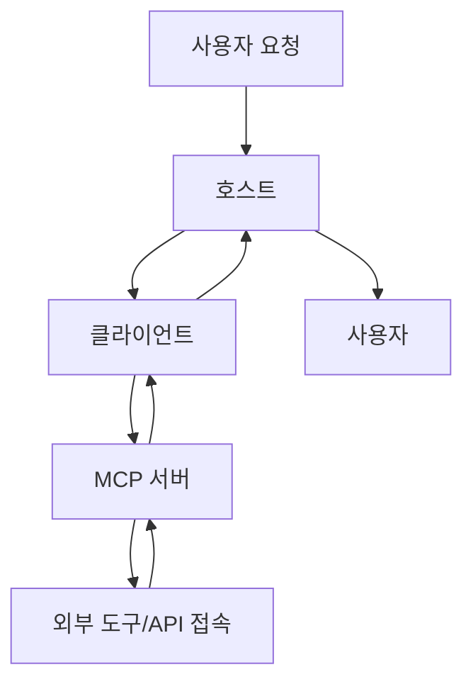

## 🔗 MCP란 무엇인가요?

### MCP의 정의
MCP(Model Context Protocol)는 AI와 외부 시스템(데이터, 서비스, 도구 등)을 표준화된 방식으로 연결해주는 프로토콜입니다. 

> 💡 비유하자면, MCP는 AI를 위한 **USB-C 포트**와 같습니다. USB-C 포트 하나로 마우스, 키보드, 외장하드 등을 연결하듯, **MCP 하나로 AI는 다양한 도구들과 연결**될 수 있습니다.

### MCP의 구성 요소
MCP는 세 가지 주요 구성 요소로 작동합니다:

- **호스트 (Host)**: 사용자가 AI와 직접 상호작용하는 인터페이스입니다. 예를 들어, Claude 앱이나 AI 채팅 앱 등이 이에 해당합니다.
- **클라이언트 (Client)**: 호스트 내부에 있으며, MCP 서버와 연결되어 요청을 주고받는 역할을 합니다.
- **서버 (Server)**: 실제 외부 시스템(API, DB, 파일 등)에 연결된 도구로, 표준 형식으로 기능을 제공합니다.

이러한 구성 요소들은 AI와 외부 시스템 간의 원활한 통신을 가능하게 하여, 다양한 도구와의 통합을 용이하게 합니다.

## 🤖 MCP 클라이언트란?

### MCP 클라이언트의 역할
**MCP 클라이언트**는 사용자용 AI 애플리케이션 내에서 작동하는 **중간 관리자**입니다. AI 모델이 외부 도구나 데이터를 필요로 할 때, 클라이언트를 통해 MCP 서버에 요청을 보냅니다. 클라이언트는 이러한 요청을 표준화된 형식으로 변환하고, 서버로부터 받은 결과를 AI에게 전달합니다.

> 📌 쉽게 말해:
> 
> 클라이언트는 "AI 모델의 비서"로서, 외부에 있는 도구들을 대신 실행해주는 역할을 합니다!

### 작동 과정 요약 (7단계)
1. **사용자 요청**: 사용자가 AI 앱(호스트)에서 요청을 보냅니다.
2. **클라이언트 전달**: 클라이언트가 해당 요청을 MCP 서버로 전달합니다.
3. **서버 작업 수행**: 서버가 외부 도구/API를 사용해 작업을 수행합니다.
4. **결과 전송**: 작업 결과를 클라이언트에게 전송합니다.
5. **결과 정리**: 클라이언트는 결과를 정리해 호스트에게 전달합니다.
6. **AI 응답 생성**: AI 모델이 결과를 기반으로 응답을 생성합니다.
7. **최종 응답**: 최종 응답을 사용자에게 보여줍니다.

## 🌐 잘 알려진 MCP 서버 목록 사이트

**MCP 마켓플레이스/커뮤니티에서 공유되는 MCP 서버 리스트**를 한눈에 볼 수 있는 사이트입니다. 다양한 MCP 서버를 쉽게 탐색하고 활용할 수 있도록 도와줍니다.

### 대표 사이트 목록

- 🌐 [mcp.so](https://mcp.so/) — 가장 대표적인 공개 MCP 서버 리스트
- 🌐 [smithery.ai](https://smithery.ai/) — 유틸리티 MCP 서버 다수 제공
- 🌐 aiexp.dev/tools — 개발자 도구 중심의 MCP 서버 소개

### 특징

- JSON 설정 코드를 바로 복사 가능
- 일부는 GitHub Token, API Key 등 추가 설정 필요
- 태그, 필터, 설명 기반 검색 기능 제공

---

## 🧭 MCP 공식 GitHub 목록

MCP 프로토콜을 만든 **Anthropic의 공식 GitHub**와 관련 커뮤니티 저장소에서 MCP 서버 예제와 정의를 확인할 수 있습니다. 이를 통해 MCP 서버의 다양한 구현 방식을 학습할 수 있습니다.

### 대표 저장소

- 🧭 [Anthropic MCP 공식 GitHub](https://github.com/anthropics/mcp) — 프로토콜 명세 및 참조 구현
- 🛠 Anthropic Server Templates — Python 등 다양한 서버 예제
- 💬 [MCP Awesome List](https://github.com/promptfoo/awesome-mcp) — 커뮤니티에서 추천하는 서버 모음
- 🧪 Langroid Tools — Langroid 기반의 MCP 도구 구현

### 포함 정보

- 프로토콜 명세 (OpenAPI 기반)
- 서버 템플릿 (예: GPT 도구 실행, 웹 API 연결 등)
- 로컬/클라우드용 샘플 구성
- JSON 설정 예시 포함

---

## ⚙️ MCP 서버 설정 방법

MCP 서버를 설정하는 방법에 대해 설명합니다. Cursor IDE를 사용하여 프로젝트별 또는 전역 설정을 할 수 있습니다.

### Cursor IDE 설정

- **프로젝트 설정하기 (해당 프로젝트에만 설정됨)**
    
    - Cursor IDE의 경우 워크스페이스 루트에 `.cursor/mcp_config.json` 파일을 생성하여 JSON 설정 파일을 작성합니다.
    
- **전역 설정하기 (모든 프로젝트에 설정됨)**
    
    - Cursor 우상단 ⚙️ 버튼을 클릭하여 Cursor Setting 화면으로 이동합니다.
    - MCP 탭을 클릭하여 MCP 목록을 확인한 후, 우상단의 + Add new global MCP server 버튼을 클릭하여 JSON 설정 파일을 작성합니다.